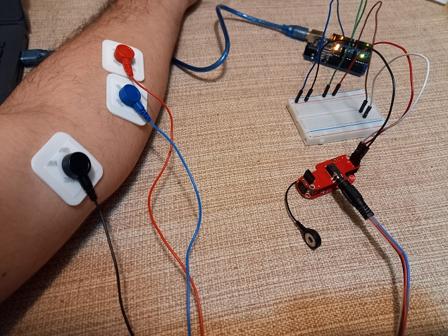
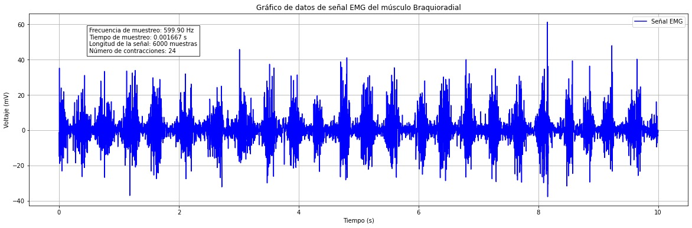
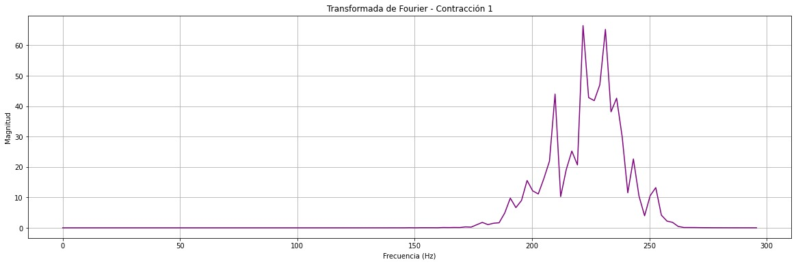
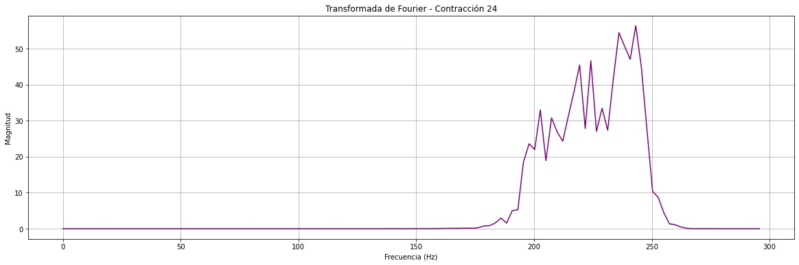

# LABORATORIO 3 PROCESAMIENTO DE SEÑALES
## TABLA DE CONTENIDOS
1. [Objetivo y Metodología del Experimento](#objetivo-y-metodología-del-experimento)
2. [Adquisición de la señal](#adquisición-de-la-señal)
3. [Filtrado de la señal](#filtrado-de-la-señal)
4. [Aplicación de ventanas](#aplicación-de-ventanas)
5. [Análisis espectral](#análisis-espectral)
6. [Análisis De Los Resultados](#análisis-de-resultados)
7. [Aplicación Biomédica](#aplicación-biomédica)
## OBJETIVO Y METODOLOGÍA DEL EXPERIMENTO
En esencia, la presente práctica tiene como objetivo extrapolar la capacidad de medir y explicar una señal EMG, determinando y/o analizando la fatiga muscular a través de la adquisición y procesamiento de dicha señal, empleando técnicas, tales como, aventanamiento y Transformada de Fourier (FFT) para el análisis espectral. La disminución en la capacidad de un músculo para mantener una contracción durante un esfuerzo prolongado (fatiga), se relaciona directamente con cambios en las frecuencias de la señal EMG. En concordancia, el objetivo específico es monitorear cómo el espectro de frecuencias de dicha señal varía en intervalos de tiempo a medida que se aproxima a la fatiga teniendo como referencia la frecuencia mediana. Además de monitorear este cambio, el experimento busca validar la relación entre la frecuencia mediana y la fatiga muscular mediante una prueba de hipótesis que determine si este cambio es estadísticamente significativo.

Para eliminar interferencias y artefactos no deseados, se aplicaron filtros pasaaltos y pasabajos. El filtro pasaaltos fue implementado para eliminar componentes de baja frecuencia, como el ruido de movimiento, mientras que el filtro pasabajos permitió atenuar el ruido de alta frecuencia proveniente de fuentes externas.

La señal filtrada fue segmentada en ventanas temporales utilizando una ventana de Hanning, elegida para minimizar las discontinuidades en los bordes de cada ventana. Además, la ventana de Hanning lleva los valores de la señal a cero en los bordes, lo que suaviza mucho más las transiciones. Esto ayuda a evitar discontinuidades grandes cuando se divide la señal en ventanas. Mientras que, La ventana de Hamming, aunque también suaviza los bordes, no baja completamente a cero en los extremos. Esto puede permitir pequeñas discontinuidades, lo que genera más "ruido" en el análisis espectral.

Se aplicaron ventanas de tamaño de 250 muestras para mantener la continuidad de la señal en el análisis espectral. A continuación, se aplicó la Transformada Rápida de Fourier (FFT) a cada ventana para obtener el espectro de frecuencias en intervalos específicos. El espectro de frecuencias de cada ventana fue analizado para evaluar los cambios en la distribución de energía conforme se aproximaba la fatiga muscular. Particularmente, se observó el comportamiento de la frecuencia mediana, un indicador clave de fatiga.

En el mismo orden de ideas, para verificar si el cambio en la frecuencia mediana fue estadísticamente significativo, se implementó una prueba de hipótesis. Se estableció una hipótesis nula (H0), donde se asumió que no había diferencia significativa en las frecuencias medianas antes y después del inicio de la fatiga, y una hipótesis alternativa (H1), donde se planteó que la frecuencia mediana disminuía significativamente conforme avanzaba el tiempo. Los datos fueron analizados utilizando un test estadístico adecuado (test de medias), con un nivel de significancia de α = 0.05.

## ADQUISICIÓN DE LA SEÑAL 
La señal electromiográfica (EMG) fue adquirida utilizando el sensor AD8232 conectado a un microcontrolador (STM32) donde la señal fue grabada mientras el estudiante realizaba una contracción isométrica del músculo braquioradial haciendo repeticiones con una mancuerna de 5Kg. A lo largo de la toma de datos, se mantuvo la contracción hasta que se evidenciaron signos de fatiga muscular, la señal fue muestreada a una frecuencia de 596 Hz, con una duración total de 10 seg. Para la adquisición se tuvo en cuenta la siguiente configuración: 



Después de haber guardado y procesado la señal, en python se muestra la gráfica capturada con todas sus características, tales como, frecuencia de muestreo, tiempo de muestreo, longitud de la señal, cantidad de contracciones y músculo medido, como se muestra en la siguiente imagen. 

<div align="center">
  
</div>

## FILTRADO DE LA SEÑAL 

Como se mencionó anteriormente se busca encontrar la llegada del músculo a la fatiga, por ende se busca realizar el filtrado de la señal mediante un pasabanda con intervalo de frecuencias de corte establecidas por literatura siendo Omega 1 = 200 Hz y Omega 2 =  250 Hz. A continuación se describen los aspectos de este filtro:

Se selecciona el filtro Butterworth pues es ideal para señales EMG ofreciendo una respuesta plana en la banda de paso, evitando así distorsiones en las frecuencias de interés. Su transición suave entre las bandas, adicional a ello en contraste con otros tipos de filtros no introduce ondulaciones como Chebyshev. El orden del filtro se asumió n = 4 y de acuerdo a ello se calcularon los Ks de la configuración. Como se muestra a continuación:

Librerias necesarias:

```python
import matplotlib.pyplot as plt
import numpy as np
from scipy.signal import butter, filtfilt, windows
from scipy import stats
```

Funciones y cálculso para creación de filtro pasabanda, aplicación respectivamente y cálculo del riple:

```python
Fs = 596  # Frecuencia de muestreo de 596 Hz

Omega1 = 200  
Omega2 = 250  
Omega_c = np.sqrt(Omega1 * Omega2)  # Frecuencia de corte central
n = 4  

K1 = 10 * np.log10(1 / (1 + (Omega1 / Omega_c) ** (2 * n)))
K2 = 10 * np.log10(1 / (1 + (Omega2 / Omega_c) ** (2 * n)))


def butter_bandpass(lowcut, highcut, Fs, order=4):
    nyquist = 0.5 * Fs  # Frecuencia de Nyquist
    low = lowcut / nyquist
    high = highcut / nyquist
    b, a = butter(order, [low, high], btype='band')
    return b, a


def aplicar_filtro(data, lowcut, highcut, Fs, order=4):
    b, a = butter_bandpass(lowcut, highcut, Fs, order=order)
    y = filtfilt(b, a, data)
    return y

lowcut = Omega1  # 200 Hz (Ω1)
highcut = Omega2  # 250 Hz (Ω2)

valores_filtrados = aplicar_filtro(valores, lowcut, highcut, Fs)

# Gráfico de la señal filtrada
plt.figure(figsize=(20, 6))  # Aumentar el tamaño del gráfico
plt.plot(tiempo, valores_filtrados, label='Señal Filtrada', color='green')
plt.title(f'Señal EMG Filtrada (Pasabanda {lowcut}-{highcut} Hz)')
plt.xlabel('Tiempo (s)')
plt.ylabel('Voltaje (mV)')
plt.grid(True)
plt.legend()

plt.show()

#Riple del filtro:

ripple = K1 - K2
print(f"Tamaño del ripple: {ripple:.2f} dB")
```

Se obtuvo entonces la siguiente señal filtrada

<div align="center">
  
</div>


## APLICACIÓN DE VENTANAS 

Luego de obtener la señal filtrada se procedio a hacer el aventanamiento:

Para llevar a cabo un sistema que logre distinguir entre la hipótesis de si la mediana disminuye o no, se seleccionó el método de Hanning para aplicar un aventanamiento suave a las contracciones de la señal EMG, lo que ayuda a minimizar los efectos de discontinuidades en los extremos de las ventanas. Asignando menos peso a los valores de los extremos y más a los valores centrales. Este método fue óptimo al estar tratando con segmentos ( contracciones musculares), porque atenúa las transiciones abruptas entre ellos, mejorando la calidad de las frecuencias analizadas. Primero se planteó la gráfica de la ventana sin aplicar a la señal EMG obteniendo lo siguiente:

<div align="center">
  
</div

Se ejemplifica el aventanamiento a cada contracción con la primera y la última respectivamente:

<div align="center">
  
</div>

<div align="center">
  
</div>

## ANÁLISIS ESPECTRAL

El análisis espectral es crucial en el estudio de la fatiga muscular, ya que permite identificar cambios en las características de la señal EMG a medida que se producen contracciones sucesivas. En este análisis, se evaluará cómo cambia el espectro de la señal EMG en cada ventana, se analizará la frecuencia mediana y se realizará una prueba de hipótesis para determinar la significancia estadística de estos cambios.

### Proceso de Análisis Espectral

1. Filtrado de la Señal: Se utilizó un filtro pasabanda para centrarse en las frecuencias relevantes de la señal EMG (200-250 Hz).

2. División en Ventanas: La señal filtrada se dividió en ventanas (contracciones) utilizando el método dividir_en_contracciones, donde se generaron 24 contracciones a partir de la señal original.
3. 
4. Aplicación de Ventanas de Hanning: Cada contracción se multiplicó por una ventana de Hanning para suavizar la señal y reducir el leakage en el espectro.

5. Cálculo de la Transformada de Fourier: Se calculó la FFT para cada contracción, y se extrajeron las magnitudes de la transformada para evaluar el espectro de frecuencias.

6. Frecuencia Mediana: Para cada contracción, se calculó la frecuencia mediana como una medida representativa de la actividad muscular en esa ventana.
   
### Observación de Cambios en el Espectro de la Señal

El análisis espectral revela que, a medida que se avanza en las contracciones, las magnitudes en frecuencias más altas tienden a disminuir. Este fenómeno indica una disminución en la capacidad del músculo para generar fuerza, lo que es característico del inicio de la fatiga muscular. A medida que el músculo se fatiga, se espera que el espectro de la señal EMG refleje una reducción en la energía de las frecuencias más altas, sugiriendo que el músculo no puede mantener su rendimiento óptimo.

<div align="center">
  
</div>

<div align="center">
  
</div>

### Evaluación de la Frecuencia Mediana

La disminución de la frecuencia mediana en cada contracción es un indicador clave de la fatiga muscular. A medida que se incrementa el número de contracciones, la frecuencia mediana disminuye consistentemente, sugiriendo que el músculo braquioradial pierde efectividad en la generación de fuerza, lo que se traduce en un estado de fatiga.

### PRUEBA DE HIPÓTESIS
Para determinar si el cambio en la frecuencia mediana es estadísticamente significativo, se realiza un test t de muestras independientes entre la frecuencia mediana de la primera y la última contracción.

- Frecuencia media de la primera contracción:223.64 Hz
- Frecuencia media de la última contracción: 225.22 Hz 
- Estadístico t:-0.61
- p-valor: 0.7600
  
## ANÁLISIS DE RESULTADOS

La prueba de hipótesis se diseñó para evaluar si existe una diferencia significativa en la frecuencia media de las contracciones del músculo braquioradial entre la primera y la última contracción. La hipótesis nula (H₀) establece que no hay diferencia significativa entre las frecuencias medias, mientras que la hipótesis alternativa (H₁) sugiere que sí hay una diferencia significativa.

- Estadístico t: El valor de -0.61 indica que la diferencia observada entre las frecuencias medias no es considerable en términos de magnitud, sugiriendo que ambas frecuencias son muy similares.
  
- p-valor: Un p-valor de 0.7600 es considerablemente alto y sugiere que la probabilidad de observar una diferencia en las medias (o una diferencia más extrema) si la hipótesis nula es cierta es del 76%.

Con un p-valor de 0.7600, que es muy superior al nivel de significancia comúnmente utilizado de 0.05, no se rechaza la hipótesis nula. Esto implica que no hay evidencia suficiente para concluir que existe una diferencia significativa entre la frecuencia media de la primera contracción y la última.

Dado que los resultados no muestran diferencias significativas entre las frecuencias medias, se puede concluir que el músculo braquioradial no presenta un cambio significativo en su capacidad de contracción entre la primera y la última contracción del experimento. Esto sugiere que, en este caso específico, no hay evidencia de que la fatiga muscular haya afectado la frecuencia de las contracciones durante el periodo analizado.

## APLICACIÓN BIOMÉDICA
El presente laboratorio tiene variedad de aplicaciones para la ingeniería biomédica, ya que contribuye al entendimiento de la función muscular y puede ser útil en varias áreas de la salud. Por ejemplo, la fatiga muscular es un fenómeno clave en la rehabilitación de pacientes con lesiones o en proceso de recuperación tras una cirugía,a modo que, los terapeutas pueden ajustar las sesiones de ejercicio de acuerdo con el estado muscular de cada paciente, evitando el sobreesfuerzo. También,  es una herramienta poderosa para diagnosticar enfermedades neuromusculares, como en el caso de la esclerosis lateral amiotrófica o la fatiga crónica (miopatías). 
